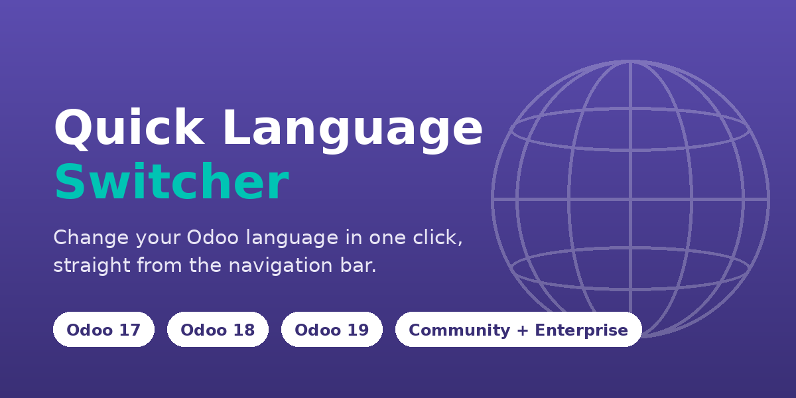
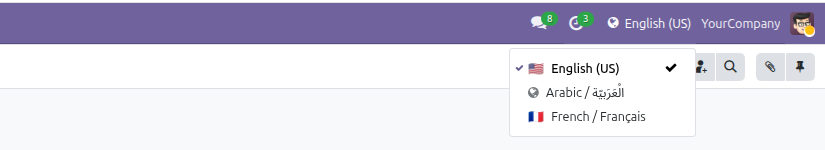
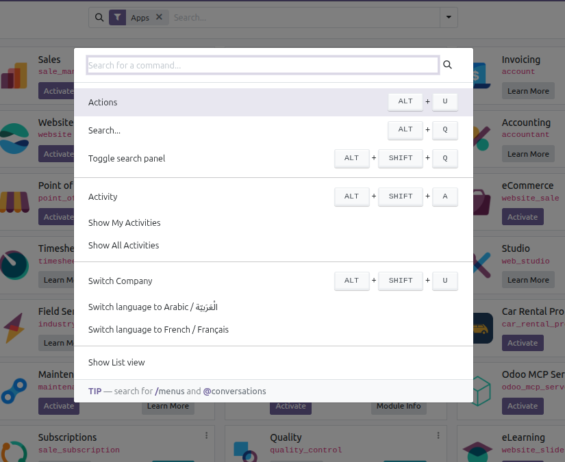

# One-Click Language Switcher

**Change your Odoo back-end language in one click, from the navigation bar.**




---

## The problem

Changing your interface language in Odoo means walking through
**Settings → Users & Companies → Users → Preferences → Language**, saving, and
reloading. Most users cannot even reach that menu: it needs administrator
rights. So in practice, on a multilingual team, people either stay in a
language they do not read well, or they ping an administrator.

## The solution

A globe in the top bar. Click it, pick a language, done.



Any internal user can change **their own** language, instantly, with no
special rights. Administrators are not involved.

---

## Features

### 🌐 One-click switching
The current language is shown in the navbar. Open the menu, click another
language, and the web client reloads fully translated. The current language is
marked and pinned at the top of the list.

### ⌨️ Command palette
Press <kbd>Ctrl</kbd>+<kbd>K</kbd> and type a language name — no mouse needed.
The switcher registers its own entries alongside Odoo's built-in commands.



Before you type anything, only the handful of languages you actually alternate
between are offered, so the palette stays readable on databases with many
languages installed.

### ⚙️ You decide what is offered
**Settings → General Settings → Languages** lets an administrator restrict the
switcher to the languages your teams actually need — useful when a database has
fifteen languages installed for translation work but should only offer four.

Leave the selection empty (the default) and every active language is offered,
so nothing changes if you never touch it.

### 🕘 Remembers your habits
The three languages you switched to most recently are pinned just under the
current one. Bilingual and trilingual users — the actual audience for this
module — never scroll or search.

### 🔎 Built for long lists
Above about ten languages a search box appears at the top of the menu,
filtering by language name **or** by code (`fr`, `pt_BR`, `arab`). The list
scrolls inside the menu instead of running off the screen.

### 🚩 Flags without the baggage
Flags are derived from the locale code using Unicode characters — no image
assets are shipped and nothing is copied from anywhere. Locales without a
country, such as Arabic (`ar_001`), fall back to a neutral globe. The language
name is always displayed, so the list stays readable even where a platform
does not render flag emoji.

### ↔️ Right-to-left ready
Arabic, Hebrew and other RTL languages work normally. The component never
forces a direction — Odoo decides — and its stylesheet uses logical CSS
properties only, so it mirrors correctly.

### 📱 Phone friendly
Icon only on small screens, icon and language name from `lg` up. The menu
stays usable at every width.

### 🧹 Nothing hardcoded, nothing left behind
The language list comes straight from your `res.lang` records: install a
language and it appears, archive it and it is gone. Uninstalling removes
everything the module added, including its single configuration entry.

---

## Requirements

| | |
| - | - |
| Odoo | 17.0, 18.0 or 19.0 |
| Edition | Community **or** Enterprise |
| Depends on | `base`, `web`, `base_setup` — all Community modules |
| Enterprise modules | none |

At least **two active languages** are required for the switcher to appear —
with only one there is nothing to switch to, so it hides itself.

## Installation

1. Copy `one_click_language_switcher` into your `addons_path`.
2. Restart Odoo.
3. **Apps → Update Apps List**, then search for *One-Click Language Switcher* and install.

```bash
./odoo-bin -d my_db --addons-path=addons,/path/to/custom_addons \
           -i one_click_language_switcher --stop-after-init
```

> Adding or removing asset files in the manifest needs an Odoo **restart**, not
> just a module upgrade: Odoo caches each manifest per process.

## Usage

1. Install at least two languages (**Settings → Translations → Languages**).
2. Open the back end.
3. Click the globe in the top-right bar, or press <kbd>Ctrl</kbd>+<kbd>K</kbd>.
4. Pick a language — the page reloads in it.

## Security

Two RPC endpoints on `res.users`, both acting **only** on the authenticated
user:

* `one_click_language_get_available()` — lists active `res.lang` records.
* `one_click_language_set(lang_code)` — validates that the code is a string
  matching an existing, active and administrator-allowed language, then writes
  `lang` on `res.users.browse(self.env.uid)`.

There is **no `user_id` argument**, so another user's record can never be
targeted. The write goes through the caller's own rights: Odoo's
`res.users.write` recognises a user editing their own record and accepts only
the fields listed in `SELF_WRITEABLE_FIELDS`, of which `lang` is one. The
administrator allow-list is enforced when writing, not merely when building the
menu, so a crafted RPC cannot select an excluded language.

No new models, no new access rights, no core patching, and no `sudo()` beyond a
single read of one configuration key.

## Testing

```bash
./odoo-bin -d my_db --addons-path=addons,/path/to/custom_addons \
           -i one_click_language_switcher --test-enable \
           --test-tags=/one_click_language_switcher --stop-after-init
```

23 backend tests cover the endpoints, the security boundary, the allow-list and
the uninstall cleanup.

## Support

Issues and questions:
<https://github.com/gamalmouhssine/one_click_language_switcher/issues>

## Licence

LGPL-3. Independent implementation built on public Odoo APIs; bundles no
third-party code or artwork.
